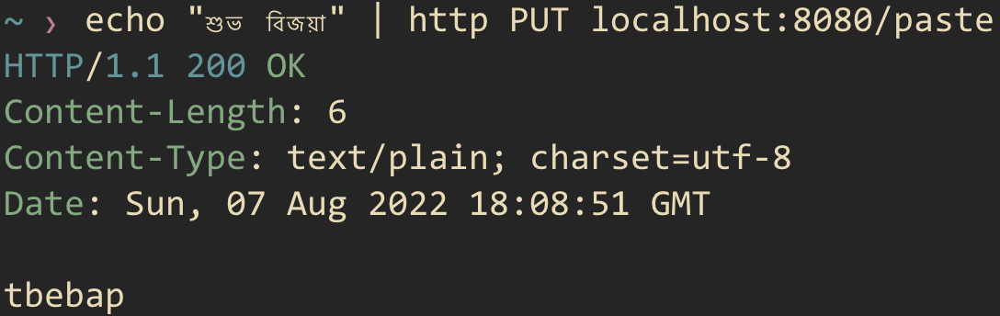
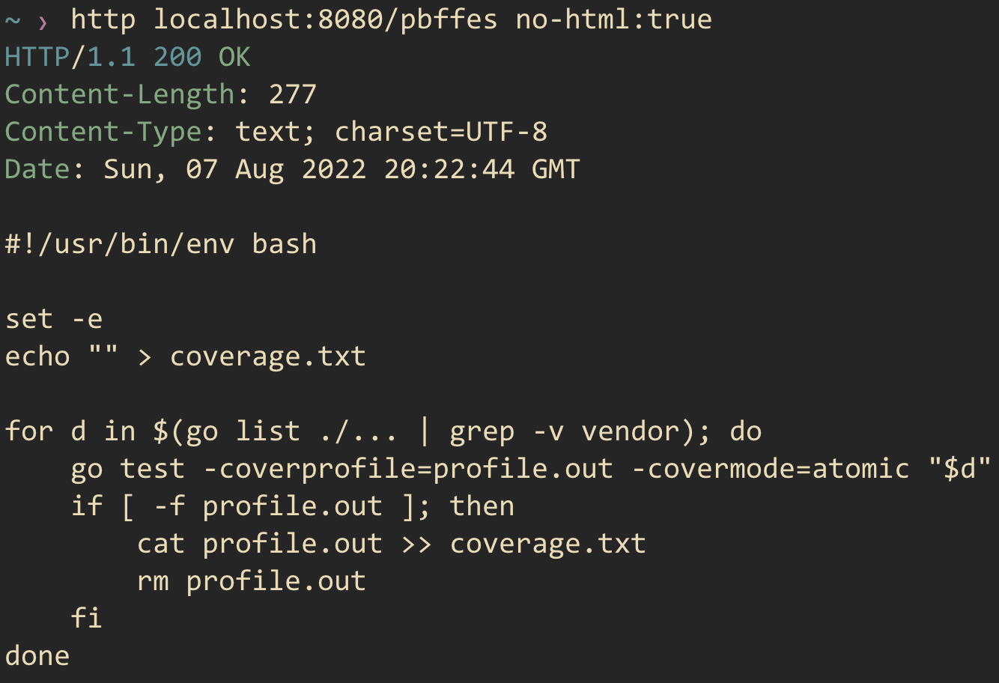

Chipku - a no frill pastebin 🗑️
==============================
Paste bin in Golang.

This is an in-memory paste bin which tries to be extremely minimal and doesn't get in the way. Simply a tool to quickly share snippets. No backend databases, no code formatting or code commenting, no self-destructing messages.

If you restart the application, you **will lose** your snippets.

Installation
------------

You may download the standalone binary and run it as,

    ./chipku serve

By default the binary starts listening on port `8080`. To change this, please set the port using `--port` flag.

    ./chipku serve --port=8081

Or you may download the project and build (or run) from source,

    go build -o chipku && ./chipku serve
    # or
    go install && chipku serve

Usage
-----

Simply visit the homepage and paste your text that you would like to share.

Or you can simply use command-line to `PUT` your text, using `httpie`

To get your snippet in command-line, set the `No-Html` HTTP header,

Developement
------------

To run tests, use

    make test

Building the docker image and running it using docker-compose (serves over port 8090)

    make up

For linting and local builds

    make lint
    make build

Credits
-------

This app was inspired by [bin](https://github.com/w4/bin), a pastebin in rust.
